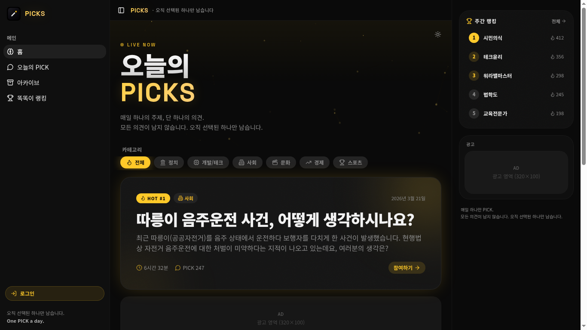
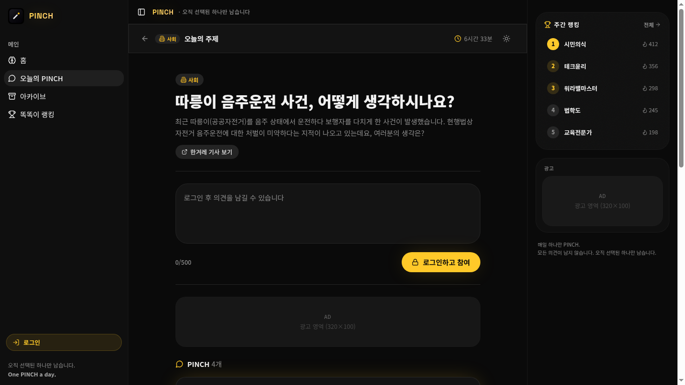
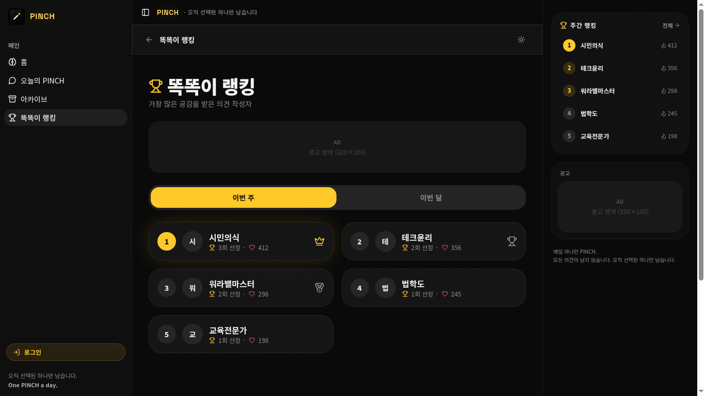

<div align="center">

# PINCH

### 매일 하나의 주제, 단 하나의 의견.

**모든 의견이 남지 않습니다. 오직 선택된 하나만 남습니다.**

[](https://usepinch.lovable.app)
[](https://lovable.dev)
[](#license)

한국어 · 2026 futuristic dark editorial design

</div>

---

## About

**PINCH** 는 한국형 일일 토론 플랫폼입니다.
하루에 단 하나의 토픽이 열리고, 사용자는 **하루 1개의 PINCH** 만 남길 수 있습니다.
가장 많은 좋아요를 받은 PINCH 한 개만 자정에 **아카이브** 로 살아남습니다.

> "매일 하나의 주제, 단 하나의 의견. 오직 선택된 하나만 남습니다."

PINCH 는 토론을 정리하지 않습니다. **선별** 합니다.

---

## Preview

| 홈 — Hot Topic | 오늘의 PINCH | 아카이브 | 똑똑이 랭킹 |
| :--: | :--: | :--: | :--: |
|  |  |  |  |

### 홈 — `/`
LIVE NOW 배너 아래 오늘의 가장 뜨거운 토픽이 단 한 장의 카드로 떠 있고, 좌측엔 사이드바, 우측엔 주간 랭킹 레일이 자리합니다. 카테고리 칩(정치·테크·사회·문화·경제·스포츠)을 누르면 해당 카테고리의 HOT 토픽으로 즉시 교체됩니다.

### 오늘의 PINCH — `/topic`
한 주제에 대해 **로그인 후 단 1개의 의견** 만 남길 수 있는 작성 화면. 500자 카운터, 마감까지 라이브 카운트다운, 마감 후 자동 잠금, 다중 탭 동시 제출 방지, 그리고 직전에 보던 토픽을 KST 일자 단위로 기억해 메뉴 재진입 시 복원합니다.

### 아카이브 — `/archive`
지난 주제와 그날 살아남은 단 하나의 PINCH. 검색 · 정렬(최신/좋아요) · 카테고리 필터를 지원하고, 각 카드는 딥링크로 공유 가능한 상세 다이얼로그를 엽니다.

### 똑똑이 랭킹 — `/ranking`
주간 / 월간 단위 PINCH 선정 횟수 + 누적 좋아요 기준 상위 작성자 랭킹. 1·2·3위에는 Crown · Trophy · Medal 배지가 부여됩니다.

---

## Tech Stack

**Frontend (only — backend는 사용자 측에서 추후 연결)**

| 영역 | 사용 기술 |
| :-- | :-- |
| Framework | **React 18** + **TypeScript 5** + **Vite 5** |
| Routing | `react-router-dom` v6 |
| Styling | **Tailwind CSS v3** + 시맨틱 디자인 토큰(HSL) |
| UI Primitives | **shadcn/ui** + **Radix UI** |
| Animation | **framer-motion** (snappy, AnimatePresence 기반 페이지 전환) |
| Icons | **lucide-react** (중앙 매핑: `src/config/navIcons.ts`) |
| Forms / Validation | `react-hook-form` + `zod` + `@hookform/resolvers` |
| Data fetching | `@tanstack/react-query` |
| Notifications | `sonner` + shadcn `toast` |
| Theme | Light/Dark 토글 (시스템 감지 + `localStorage` 우선) |
| Date/Time | `date-fns` (KST 일자 기준 마감/롤오버) |
| Charts | `recharts` |
| Testing | **Vitest** + Testing Library + **Playwright** |
| Linting | ESLint + 자체 브랜드 용어 스캐너 (`scripts/scan-brand-terms.mjs`) |

### 디자인 시스템 원칙
- **Bento grid · glassmorphism · noise texture** 의 2026 futuristic dark editorial 톤
- 폰트: **Space Grotesk** (영문/숫자) + **Noto Sans KR** (한글)
- 색상은 모두 `index.css` 의 HSL 시맨틱 토큰만 사용 — 컴포넌트에 raw color 클래스 금지
- 반응형 셸: mobile = BottomNav, md+ = sidebar, xl+ = right rail
- 디바이스 분기는 시맨틱 유틸(`.mobile-only`, `.tablet-up`, `.wide-up-flex`) 만 사용

### 브랜드 거버넌스
- **PINCH** (서비스명, 영문 대문자 고정), **PINCH** (개별 의견)
- 모든 브랜드 용어 정의는 `src/brand/terms.mjs` 단일 소스
- `npm run scan:brand` 로 레거시 표기("한마디"·"댓글" 등) 자동 감지

---

## Quick Start

```bash
# 1) 의존성 설치
npm install

# 2) 개발 서버
npm run dev

# 3) 프로덕션 빌드 & 미리보기
npm run build
npm run preview
```

추가 스크립트:

```bash
npm run lint           # ESLint
npm run test           # Vitest 단위 테스트
npm run scan:brand     # 브랜드 용어 스캐너 (PINCH 표기 검증)
```

> Node.js `>=18` 권장.

---

## Project Structure

```
src/
├── pages/              # 라우트 단위 화면 (Index, Topic, Archive, Ranking, MyPage, Settings, Admin, Auth)
├── components/
│   ├── shell/          # AppShell · AppSidebar · BottomNav · RightRail · SiteFooter
│   ├── brand/          # PinchLogo, PinchMark (브랜드 락업 단일 소스)
│   ├── auth/           # 로그인/회원가입/비밀번호 정책 UI
│   ├── topic/          # HeartBurst 등 토픽 인터랙션
│   ├── onboarding/     # 첫 방문 온보딩
│   └── ui/             # shadcn primitives
├── config/
│   └── navIcons.ts     # 모든 네비 아이콘 단일 매핑
├── data/               # mockData, adminData, myPageData, pickMetrics (브랜디드 타입 가드)
├── brand/              # 브랜드 용어 시스템 (terms.mjs · BrandText · 스캐너 연동)
├── hooks/              # useAuth, useAdminAuth, use-toast, use-mobile
└── index.css           # HSL 디자인 토큰 + 시맨틱 유틸리티
```

---

## Routes

| Path | Page |
| :-- | :-- |
| `/` | 홈 — 오늘의 HOT 토픽 + 카테고리 + 주간 랭킹 |
| `/topic` | 오늘의 PINCH 작성/조회 (1인 1 PINCH / 자정 KST 마감) |
| `/archive` | 아카이브 (검색·필터·딥링크 다이얼로그) |
| `/ranking` | 똑똑이 랭킹 (주간/월간) |
| `/mypage` | 마이페이지 (내 PINCH · 받은 좋아요 · 연속 참여) |
| `/settings` | 설정 (테마·알림·계정) |
| `/auth` | 로그인 / 회원가입 / 전화번호 인증 |
| `/admin` | 어드민 (토픽/유저/신고 모더레이션) |
| `/legal` | 약관 · 개인정보 처리방침 |

---

## Core Rules

1. **하루 1 PINCH** — KST 자정 기준으로 잠금/해제. 다중 탭/디바이스 동기화.
2. **단 하나만 남는다** — 자정에 가장 좋아요가 많은 PINCH 한 개만 아카이브로 영속화.
3. **카테고리당 1 토픽** — 하루에 카테고리당 정확히 한 개의 토픽이 열림.
4. **랭킹** — PINCH 선정 횟수 + 누적 좋아요 기준, 주간·월간 집계.

---

## Roadmap (Frontend Mockup → Production)

현재 저장소는 **프론트엔드 UI 목업** 입니다. 다음 백엔드 연동이 예정되어 있습니다:

- [ ] 인증 (전화번호 OTP + 소셜 로그인 OAuth)
- [ ] PINCH 제출/좋아요 영속화
- [ ] 자정 마감 → 아카이브 승급 배치
- [ ] 신고/모더레이션 큐
- [ ] 실시간 랭킹 집계

---

## License

This project is distributed under a **Non-Commercial License**.

- Commercial use is not allowed.
- Selling this software is not allowed.
- Monetized distribution is not allowed.
- Redistributed copies must include this license notice.

This is a custom non-commercial license and not an OSI-approved open-source license.

---

<div align="center">

**PINCH** — One PINCH a day.

[usepinch.lovable.app](https://usepinch.lovable.app)

</div>
