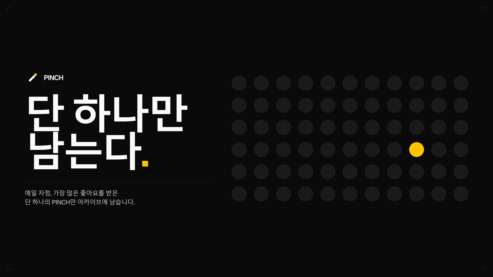
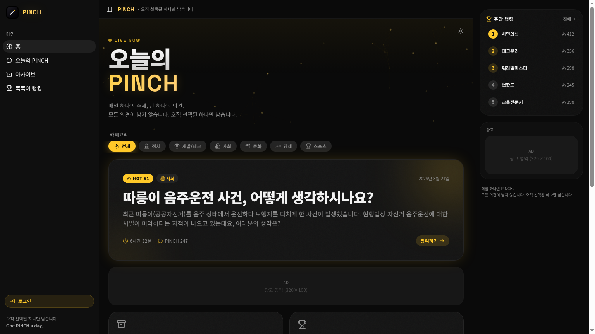
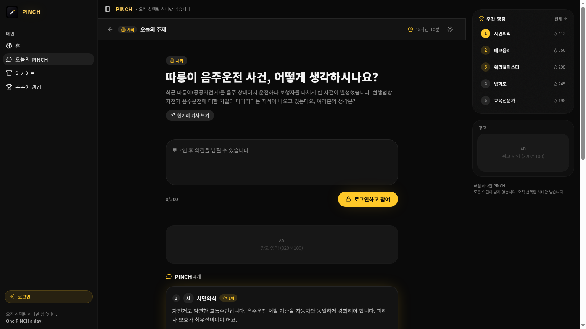
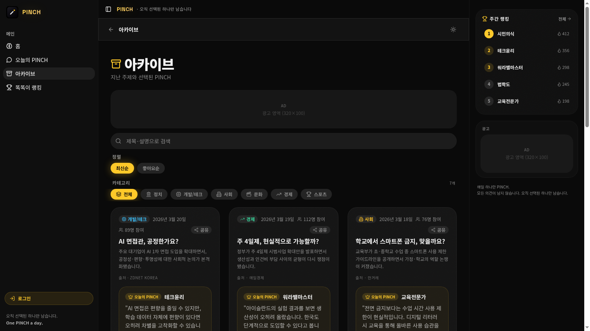
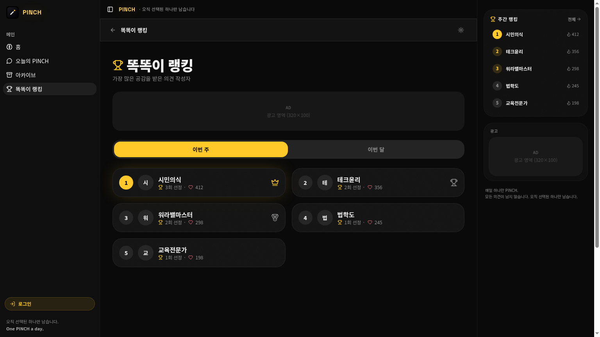

 

 
 

# ✦ PINCH ✦

### _매일 하나의 주제, 단 하나의 의견._

**모든 의견이 남지 않습니다. 오직 선택된 하나만 남습니다.**

 

 

`정치` · `테크` · `사회` · `문화` · `경제` · `스포츠`

 

---

 

## ✦ What is PINCH?

> **PINCH** 는 한국형 일일 토론 플랫폼입니다.

하루에 단 하나의 토픽이 열리고, 
사용자는 **하루 단 1개의 PINCH** 만 남길 수 있습니다.

가장 많은 좋아요를 받은 **단 하나의 PINCH** 만 
자정에 ✦ **아카이브** 로 살아남습니다.

 

> _PINCH 는 토론을 정리하지 않습니다._ 
> _**선별** 합니다._

 

---

 

## ✦ Preview

<table>
<tr>
<td width="50%" align="center">

  
<b>홈 — Hot Topic</b>
 
LIVE NOW 배너 아래 오늘의 가장 뜨거운 토픽이 단 한 장의 카드로 떠 있습니다.
</td>
<td width="50%" align="center">

  
<b>오늘의 PINCH</b>
 
로그인 후 단 1개의 의견만. 500자 카운터 · 라이브 카운트다운 · 자동 잠금.
</td>
</tr>
<tr>
<td width="50%" align="center">

  
<b>아카이브</b>
 
지난 주제와 그날 살아남은 단 하나의 PINCH. 검색 · 정렬 · 카테고리 필터.
</td>
<td width="50%" align="center">

  
<b>똑똑이 랭킹</b>
 
주간 / 월간 단위 PINCH 선정 횟수 + 누적 좋아요. 1·2·3위에는 👑 🏆 🥉 배지.
</td>
</tr>
</table>

 

---

 

## ✦ Core Rules

<table>
<tr>
<td align="center" width="25%">
<h3>01</h3>
<b>하루 1 PINCH</b>
  
KST 자정 기준 잠금 / 해제
</td>
<td align="center" width="25%">
<h3>02</h3>
<b>단 하나만 남는다</b>
  
가장 좋아요 많은 PINCH 한 개만 아카이브
</td>
<td align="center" width="25%">
<h3>03</h3>
<b>카테고리당 1 토픽</b>
  
하루에 카테고리당 정확히 한 개
</td>
<td align="center" width="25%">
<h3>04</h3>
<b>똑똑이 랭킹</b>
  
선정 횟수 + 좋아요 주간 · 월간 집계
</td>
</tr>
</table>

 

---

 

### ✦

 

**PINCH**

_One PINCH a day._

 

[**→ usepinch.lovable.app**](https://usepinch.lovable.app)

 

© 2026 PINCH · Built in Korea

